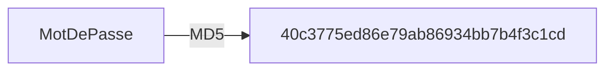
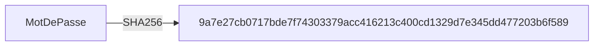
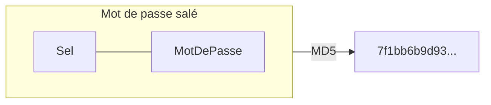

Bienvenue au cours d'introduction à la cybersécurité. Le cours se divise en 3 parties:

1. Fondements de la cybersécurité
2. Cybersécurité des réseaux et postes de travail
3. Cybersécurité applicative

On veut susciter des **discussions** de groupe. On veut des cours **dynamiques**. Soyez **participatifs**! 

Vous pouvez récupérer votre plan de cours dans Léa.


:::warning
Dans ce cours, vous apprendrez des techniques de _hacking_ qui,
en dehors du cadre de ce cours, peuvent être **interdites** ou **illégales**.
Vous devez vous conformer aux lois et réglementations en vigueur et ne pas
utiliser ces compétences à des fins malveillantes ou sans autorisation préalable.

Soyez **responsables** et utilisez vos connaissances de
manière **éthique** et **légale**. La cybersécurité est un domaine
passionnant, mais il est essentiel de respecter les droits et la vie privée
des autres.
:::


## Qu'est-ce que la cybersécurité?

Sécurité (Larousse): "Situation dans laquelle quelque chose n'est exposé à aucun danger ni aucun risque de vol ou de détérioration."

Exemples:
- un verrou sur une porte
- un système d'alarme
- un détecteur de fumée
- une caméra de surveillance.

La **cybersécurité**, c'est la protection des informations, des systèmes et des services informatiques contre des menaces telles que 
- des désastres naturels, 
- des erreurs, 
- des fraudes, etc. 

Elle a pour objectif de prévenir, de réduire la probabilité et l'impact de ces incidents au minimum.

## Menace, vulnérabilité, exploits, correctifs

La jargon de la cybersécurité. 

| Termes                  | Définition                                                                            | Exemple pour une maison                                                                                                                                                                                                               | Exemple cyber |
|-------------------------|---------------------------------------------------------------------------------------|---------------------------------------------------------------------------------------------------------------------------------------------------------------------------------------------------------------------------------------| --- |
| Menace                  | Un événement / quelque chose / quelqu'un pouvant causer du dommage                    | Un frère qui veut emprunter ton vélo                                                                                                                                                                                                  | Un hacker |
| Faille /  Vulnérabilité | Une faiblesse pouvant être exploitée                                                  | Un antivol à code cheapette                                                                                                                                                                                                           | Un mot de passe faible |
| Exploit                 | La série d'étapes techniques détaillées permettant d'exploiter la faille concrétement | Tirer sur l'arceau tout du long <br/> Tourner la roue la plus à gauche et s'arrêter sur le chiffre qui résiste <br/> Faire la même chose sur le chiffre 2 3 et 4 <br/> Revenir sur les roues précédentes si ça n'ouvre pas et répéter | Le hacker qui devine le mot de passe faible |
| Correctif               | Une mesure pour corriger une vulnérabilité                                            | Installer un verrou sur la porte                                                                                                                                                                                                      | Utiliser un mot de passe fort |
| Risque                  | La probabilité ou le potentiel de dommage                                             | La probabilité que le cambrioleur entre et vole des objets de valeur                                                                                                                                                                  | La probabilité que le hacker devine le mot de passe et accède à des données sensibles |   


Notre job de tech:

- Le vol de mes données confidentielles
- Mon ordinateur est contrôlé par un hacker
- Le service est dégradé, je n’ai plus accès à rien
- Un service que je crois légitime est faux
- Toutes mes données sont effacées

Pour ne pas que ces menaces constituent un risque réel, il faut se protéger en éliminant, ou en mitigeant, les vulnérabilités. Vous avez sans doute en tête plusieurs méthodes de protection: un **mot de passe** solide, un **antivirus**, un **pare-feu**, un **VPN**, une méthode de **chiffrement** (*encryption*), etc. Nous les explorerons plus en détails dans les semaines qui viennent.


## Du hash, du crack et du sel


### Partie 1: Hacher des mots de passe

Les mots de passe ne sont jamais stockés en texte clair dans les bases de données. 

Avant de le stocker, il faut le hacher, c'est-à-dire le passer dans un algorithme qui :
- prend le mot de passe en entrée de longueur varible
- génère une chaîne de caractères (le hachage) en sortie de longueur fixe
- est unidirectionnel : il est impossible de faire l'opération inverse
- va le convertir en quelque chose d'illisible. [Wikipédia](https://fr.wikipedia.org/wiki/Fonction_de_hachage_cryptographique)

Il existe plusieurs algorithmes de hachage. Aujourd'hui, nous allons utiliser l'algorithme **MD5**.





#### 

:::danger
Pour les activités d'aujourd'hui, vous devrez inventer des mots de passe. **Ne choisissez jamais un mot de passe que vous utilisez réellement!**
:::


1. Allez sur le site https://www.md5hashgenerator.com
2. Entrez un premier exemple de mot de passe, par exemple : **ceci est mon super mot de passe** et regardez le hachage MD5
3. Maintenant, ajoutez simplement un caractère à la fin (par exemple **ceci est mon super mot de passe!**) et regardez le hachage
   - les mots de passe sont similaires
   - est-ce que les hachages sont similaires?
4. Faites-vous une liste de plusieurs mots de passe que vous pensez faciles à craquer, d'autres moins simples et un ou 2 que vous pensez vraiment difficiles. Notez le mot de passe et le hachage correspondant dans un fichier texte.
   - un nombre de 10 chiffres
   - un nombre de 20 chiffres
   - essayez un mot de passe long mais simple comme **ceci est mon secret le plus secret ahah**
   - essayez un mot de passe court (5-6 caractères) mais avec des caractères spéciaux **P%9Ab8$**


#### Discussion

Quelques questions qu'on discutera à la fin de l'activité:

- Est-ce que tous les hachages ont **la même longueur?** (vous pouvez les aligner dans un éditeur de texte pour mieux voir le nombre de caractères de chacun)
- Est-ce qu'il y a une limite dans le **nombre de hachages possibles**? Si oui, combien?
- Est-ce que le nombre de **mots de passe possibles** est limité ou illimité?
- Est-ce qu'il y a des mots de passe différents qui auraient **le même hachage**?
- Est-ce que c'est facile de **deviner** le mot de passe si je vous donne le hachage?

### Partie 2 : Craquer des mots de passe

Une fonction de hachage est **unidirectionnelle** : il est impossible de faire l'opération inverse, c'est‑à‑dire convertir un hachage pour retrouver le mot de passe qui l'a généré. Pour valider un mot de passe, on demande le mot de passe à l'utilisateur, on le hache, puis on compare le hachage avec celui stocké dans la base de données. S'ils concordent, on suppose que le mot de passe est valide. Les chances qu'un autre mot de passe que le vôtre génère le même hachage, avec l'algorithme MD5, sont de 2<sup>128</sup>, soit environ 340 sextillions. 

Donc si un pirate s'introduit dans une base de données et vole les hachages de mots de passe, il ne pourra pas directement trouver les mots de passe des utilisateurs. En théorie. Parce que comme vous allez le voir, certains mots de passe sont plus faciles à craquer que d'autres!

#### Discussion

- Selon vous, comment marche le site Crack Station?
- Qu'est-ce qui semble important pour qu'un mot de passe soit sécuritaire? Sa longueur? Autre?


### Partie 3 : Saler des mots de passe

On peut réduire le risque qu'un hachage soit craqué en lui introduisant un **sel** (*salt*). Le sel est une partie du mot de passe qui est inconnue de l'utilisateur. Lorsque l'utilisateur entre son mot de passe, l'application lui ajoute automatiquement le sel, puis passe les deux ensemble dans l'algorithme de hachage.



# Exercice / CTF

Chaque séance, nous aurons des exercices / CTF (Capture The Flag) à réaliser.

1. Allez sur [ce générateur de hachage MD5](https://webutility.io/md5-hash-generator-with-salt). Il permet de générer un *hachage* salé avec un sel de votre choix.
2. Essayez d'entrer les mots de passe précédents qui ont été craqués avec succès (un à la fois).
3. Prenez en note le hachage puis essayez de les craquer de nouveau avec CrackStation

---

## 🚩 CTF-crack (2 points)

📄 **Fichier de remise**: `ctf-crack.md`

**Objectif**: Craquer les hachages MD5 fournis et trouver les mots de passe originaux.

Voici une liste de hachages MD5 interceptés. Votre mission est de retrouver les mots de passe correspondants:

8d4d82ab28ab3287520c334545eda1eb
```text
2dd422cb609c9f115b229babf0308723
39c0f34be508d07a9d350318010d19a4
f6d928890d38b3f5b76ff5ca7db8959c
25138b6ee073a66f529c8fcc72108ec9
0674272bac0715f803e382b5aa437e08
de81459305398c88048a05a620fb4717
5f02f0889301fd7be1ac972c11bf3e7d
b89f7a5ff3e3a225d572dac38b2a67f7
0f5264038205edfb1ac05fbb0e8c5e94
8d4d82ab28ab3287520c334545eda1eb
43d2335dd28753bff6634ccff9d6efe3
de81459305398c88048a05a620fb4717
5f02f0889301fd7be1ac972c11bf3e7d
b89f7a5ff3e3a225d572dac38b2a67f7
ba36fe9406f8806dbbcc0ab92a1b75ad
0ecee728bf87a4c1a02883004044dcd5
23b9eda5846a4017ec006a8b998cea72
25138b6ee073a66f529c8fcc72108ec9
```

**Votre mission**:
1. Utilisez [Crack Station](https://crackstation.net) ou un autre outil de craquage de hash
2. Identifiez quels mots de passe ont pu être craqués
3. Produit le flag comme suit: `CEM{mdp1-mdp2-mdp3-...}`

**Récompense**: 
- Crée un compte sur https://ctf.info.cegepmontpetit.ca/ 
- Collecte tes points sur https://ctf.info.cegepmontpetit.ca/challenges#Crack%20MD5-18
- Classement : https://ctf.info.cegepmontpetit.ca/scoreboard

**À inclure dans votre rapport**:
- La liste des hachages avec leurs mots de passe correspondants (quand trouvés)
- Pourquoi certains hachages n'ont pas pu être craqués selon vous?

:::tip Réflexion
- Qu'est-ce qui rend un mot de passe facile ou difficile à craquer?
- Comment fonctionne Crack Station? (tables arc-en-ciel, dictionnaires...)
:::

---

## 🚩 CTF-du-hash-des-bits-MD5 (2 point)

📄 **Fichier dans ton repo**: `ctf-has-bits-md5.md`

**Objectif**: les algos de hachage génèrent des hachages de longueur fixe. Le but de ce CTF est de trouver la longueur en bits d'un hash.

**Votre mission**:
1. Produire le hash MD5 de "bits bits bits hash hash hash" ce qui te donne **hash**
2. Trouver la longueur du hash en nombre de caractères ce qui te donne **lc**
3. Déduire sa longueur en bits ce qui te donne **lb**
4. La valeur du CTF sera `CEM{hash-lc-lb}`

## 🚩 CTF-du-hash-des-bits-SHA256 (2 point)
📄 **Fichier dans ton repo**: `ctf-has-bits-sha256.md`
**Objectif**: les algos de hachage génèrent des hachages de longueur fixe. Le but de ce CTF est de trouver la longueur en bits d'un hash.
**Votre mission**:
1. Produire le hash SHA256 de "bits bits bits hash hash hash" ce qui te donne **hash**
2. Trouver la longueur du hash en nombre de caractères ce qui te donne **lc**
3. Déduire sa longueur en bits ce qui te donne **lb**
4. La valeur du CTF sera `CEM{hash-lc-lb}`

## 🚩 CTF-du-hash-des-bits-SHA512 (2 point)
📄 **Fichier dans ton repo**: `ctf-has-bits-sha512.md`
**Objectif**: les algos de hachage génèrent des hachages de longueur fixe. Le but de ce CTF est de trouver la longueur en bits d'un hash.
**Votre mission**:
1. Produire le hash SHA512 de "bits bits bits hash hash hash" ce qui te donne **hash**
2. Trouver la longueur du hash en nombre de caractères ce qui te donne **lc**
3. Déduire sa longueur en bits ce qui te donne **lb**
4. La valeur du CTF sera `CEM{hash-lc-lb}`


## 🚩 CTF-court-et-incassable (1 point)

📄 **Fichier dans ton repo**: `ctf-court-et-incassable.md`

**Objectif**: Trouver un mot de passe de 4 caractères ou moins que Crack Station n'arrive pas à craquer.

**Votre mission**:
1. Trouvez un mot de passe de **4 caractères maximum** 
2. Générez son hash MD5 avec [ce générateur](https://www.md5hashgenerator.com)
3. Vérifiez que Crack Station ne peut PAS le craquer

**Indice**: Vous pouvez partir de `()[]{}`

**Récompense bonus**: 
- **3 points supplémentaires** si vous trouvez un mot de passe non craquable de **7 caractères ou moins**

**À inclure dans votre rapport**:
- Le mot de passe trouvé
- Son hash MD5
- Une capture d'écran prouvant que Crack Station ne peut pas le craquer
- Votre explication de pourquoi ce mot de passe court résiste au craquage

---

### Partie 3 : Saler des mots de passe

On peut réduire le risque qu'un hash soit craqué en lui introduisant un **sel** (*salt*). Le sel est une partie du mot de passe qui est inconnue de l'utilisateur. Lorsque l'utilisateur entre son mot de passe, l'application lui ajoute automatiquement le sel, puis passe les deux ensemble dans l'algorithme de hachage.


#### En pratique

1. Allez sur [ce générateur de hachage MD5](https://webutility.io/md5-hash-generator-with-salt). Il permet de générer un *hachage* salé avec un sel de votre choix.
2. Essayez d'entrer les mots de passe précédents qui ont été craqués avec succès (un à la fois).
3. Prenez en note le hachage puis essayez de les craquer de nouveau avec CrackStation

#### Discussion

- Selon vous, comment marche le site Crack Station?
- Qu'est-ce qui semble important pour qu'un mot de passe soit sécuritaire? Sa longueur? Autre?

---

## 🚩 CTF-crack (2 points)

📄 **Fichier de remise**: `ctf-sale-mais-pas-top.md`

**Objectif**: Créer un hachage MD5 salé qui sera quand même craquable par CrackStation.

**Votre mission**:
1. Utilisez le [générateur de hachage MD5 avec sel](https://webutility.io/md5-hash-generator-with-salt)
2. Trouvez une combinaison mot de passe + sel qui produit un hachage craquable par CrackStation
3. Documentez votre découverte

:::tip Indice
Réfléchissez à comment CrackStation fonctionne... Si le sel + mot de passe forme quelque chose de connu, ça pourrait marcher!
:::

**Récompense**: 1 point au tableau des scores si vous trouvez une combinaison craquable.

**À inclure dans votre rapport**:
- Le mot de passe utilisé
- Le sel utilisé
- Le hachage généré
- La preuve que CrackStation a réussi à le craquer
- Votre explication de pourquoi ça a fonctionné

---

#### Discussions

- Un mot de passe salé est-il toujours plus sécuritaire?
- Pourquoi le site CrackStation a-t-il plus de difficulté à craquer les hachages lorsqu'ils sont salés?


## Présentation du TP1

Le prof va présenter le [travail pratique 1](../tp/tp1). Il se fera en équipe de 2.
