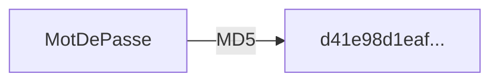
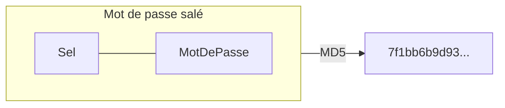

Bienvenue au cours d'introduction à la cybersécurité. Le cours se divise en 3 parties:

1. Introduction aux fondements de la cybersécurité
2. Cybersécurité des réseaux et postes de travail
3. Cybersécurité applicative

On veut susciter des **discussions** de groupe. On veut des cours **dynamiques**. Soyez **participatifs**! 

Vous pouvez récupérer votre plan de cours dans Léa.


## Qu'est-ce que la cybersécurité?

La **sécurité** est une situation dans laquelle quelque chose n'est exposé à aucun danger ni aucun risque de vol ou de détérioration (définition tirée du dictionnaire Larousse). C'est en quelque sorte l'absence ou la limitation des risques dans un domaine précis. On cherche à se prémunir contre diverses menaces tant naturelles qu'humaines. Par exemple, un verrou sur une porte, un système d'alarme, un détecteur de fumée et une caméra de surveillance contribuent à rehausser le niveau de sécurité.

La **cybersécurité**, c'est la protection des informations, des systèmes et des services informatiques contre des menaces telles que des désastres naturels, des erreurs, des fraudes, etc. Elle a pour objectif de réduire la probabilité et l'impact de ces incidents au minimum.


## Menaces, vulnérabilités, risques et exploits

Tout au long du cours, nous rencontrerons certains termes propres au domaine de la cybersécurité. Les **menaces** (*threats*), ou cybermenaces, sont des événements pouvant causer un dommage ou un préjudice à un système, un équipement, un service ou des données. Les **vulnérabilités** sont les faiblesses d'un système pouvant être **exploitées** pour causer du dommage. On appelle **risque** la probabilité ou le potentiel de dommage ou de préjudice si une menace parvient à exploiter une vulnérabilité.

Voici quelques exemples de cybermenaces:

- Le vol de mes données confidentielles
- Mon ordinateur est contrôlé par un hacker
- Le service est dégradé, je n’ai plus accès à rien
- Un service que je crois légitime est faux
- Toutes mes données sont effacées

Pour ne pas que ces menaces constituent un risque réel, il faut se protéger en éliminant, ou en mitigeant, les vulnérabilités. Vous avez sans doute en tête plusieurs méthodes de protection: un **mot de passe** solide, un **antivirus**, un **pare-feu**, un **VPN**, une méthode de **chiffrement** (*encryption*), etc. Nous les explorerons plus en détails dans les semaines qui viennent.

## Activité

Nous vous suggérons quelques activités pour briser la glace. Dans cette série d'exercices, nous allons explorer les mots de passe.

:::warning
Dans ce cours, vous apprendrez des techniques de _hacking_ qui, en dehors du cadre de ce cours, peuvent être **interdites** ou **illégales**. Vous devez vous conformer aux lois et réglementations en vigueur et ne pas utiliser ces compétences à des fins malveillantes ou sans autorisation préalable.

Soyez **responsables** et utilisez vos connaissances de manière **éthique** et **légale**. La cybersécurité est un domaine passionnant, mais il est essentiel de respecter les droits et la vie privée des autres.
:::

### Partie 1: Hacher des mots de passe

Nous y reviendrons plus tard, mais les mots de passe sont rarement stockés en texte clair dans les bases de données des applications. Avant de le stocker, il faut le hacher, c'est-à-dire le passer dans un algorithme qui va le convertir en quelque chose d'illisible. [Voir cet article sur Wikipédia.](https://fr.wikipedia.org/wiki/Fonction_de_hachage_cryptographique)

Il existe plusieurs algorithmes de hachage. Aujourd'hui, nous allons utiliser l'algorithme **MD5**. Une opération de hachage effectue un calcul mathématique sur chaque caractère de la chaîne. Le hachage est le résultat de ce calcul. 



#### Exercice à réaliser

:::danger
Pour les activités d'aujourd'hui, vous devrez inventer des mots de passe. **Ne choisissez jamais un mot de passe que vous utilisez réellement!**
:::


1. Va sur le site https://www.md5hashgenerator.com
2. Entre un premier exemple de mot de passe, par exemple : **ceci est mon super mot de passe** et regarde le hash MD5
3. Maintenant ajoute simplement un caractère à la fin (pour moi **ceci est mon super mot de passe!**) et regarde le hash
   - les mots de passe sont similaires
   - est-ce que les hash sont similaires?
4. Fais-toi une liste de plusieurs mots de passe que tu penses faciles à craquer, d'autres moins simples et un ou 2 que tu penses vraiment hardcore. Note le mot de passe et le hash correspondant dans un fichier texte.
   - un nombre de 10 chiffres
   - un nombre de 20 chiffres
   - essaie un mot de passe long mais simple comme **ceci est mon secret le plus secret ahah**
   - essaie un mot de passe court (5-6 caractères) mais avec des trucs spéciaux **P%9Ab8$**


#### Discussion

Quelques questions qu'on discutera à la fin de l'activité:

- Est-ce que tous les hashs ont **la même longueur?** (tu peux les aligner dans un éditeur de texte pour mieux voir le nombre de caractères de chacun)
- Est-ce qu'il y a une limite dans le **nombre de hash possibles**? Si oui, combien?
- Est-ce que le nombre de **mots de passe possibles** est limité ou illimité?
- Est-ce qu'il y a des mots de passe différents qui auraient **le même hash**?
- Est-ce que c'est facile de **deviner** le mot de passe si je te donne le hash?

### Partie 2 : Craquer des mots de passe

Une fonction de hachage est **unidirectionnelle** : il est impossible de faire l'opération inverse, c'est‑à‑dire convertir un hash pour retrouver le mot de passe qui l'a généré. Pour valider un mot de passe, on demande le mot de passe à l'utilisateur, on le hache, puis on compare le hash avec celui stocké dans la base de données. S'ils concordent, on suppose que le mot de passe est valide. Les chances qu'un autre mot de passe que le vôtre génère le même hash, avec l'algorithme MD5, sont de 2<sup>128</sup>, soit environ 340 sextillions. 

Donc si un pirate s'introduit dans une base de données et vole les hash de mots de passe, il ne pourra pas directement trouver les mots de passe des utilisateurs. En théorie. Parce que comme vous allez le voir, certains mots de passe sont plus faciles à craquer que d'autres!


#### Exercice à réaliser

On va utiliser le site [Crack Station](https://crackstation.net) pour cette activité:

1. On va commencer en entrant les hash MD5 suivants dans le site:
   ```text
   dc647eb65e6711e155375218212b3964
   eb61eead90e3b899c6bcbe27ac581660
   958152288f2d2303ae045cffc43a02cd
   2c9341ca4cf3d87b9e4eb905d6a3ec45
   75b71aa6842e450f12aca00fdf54c51d
   031cbcccd3ba6bd4d1556330995b8d08
   b5af0b804ff7238bce48adef1e0c213f
   ```
2. Tu devrais voir que certains mots de passe ont été craqués et d'autres non.
3. Maintenant en prenant les md5 que tu as générés dans la première activité en les mettant dans le même format que le bloc de l'étape 1 regarde quels sont ceux qui ont été craqués ou pas.

#### Discussion

- Selon vous, comment marche le site Crack Station?
- Qu'est-ce qui semble important pour qu'un mot de passe soit sécuritaire? Sa longueur? Autre?


### Partie 3 : Saler des mots de passe

On peut réduire le risque qu'un hash soit craqué en lui introduisant un **sel** (*salt*). Le sel est une partie du mot de passe qui est inconnue de l'utilisateur. Lorsque l'utilisateur entre son mot de passe, l'application lui ajoute automatiquement le sel, puis passe les deux ensemble dans l'algorithme de hachage.



#### Exercices à réaliser

1. Allez sur [ce générateur de hash MD5](https://webutility.io/md5-hash-generator-with-salt). Il permet de générer un *hash* salé avec un sel de votre choix.
2. Essayez d'entrer les mots de passe précédents qui ont été craqués avec succès (un à la fois).
3. Prenez en note le hash puis essayez de les craquer de nouveau avec CrackStation

Petit défi: Pouvez-vous faire un hash salé qui sera facilement craquable par CrackStation?

#### Discussions

- Un mot de passe salé est-il toujours plus sécuritaire?
- Pourquoi le site CrackStation a-t-il plus de difficulté à craquer les hash lorsqu'ils sont salés?


## Présentation du TP1

À la fin du cours, votre professeur vous a présenté le premier travail pratique de la session. Il se fera en équipe de 2. Consultez [l'énoncé du TP](/tp/tp1) pour plus de détails.
