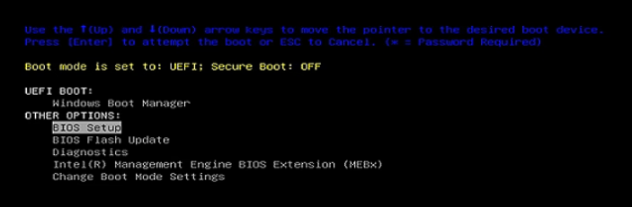

import Tabs from '@theme/Tabs';
import TabItem from '@theme/TabItem';

:::note Plan de la rencontre

Les séances 4 et 5 sont consacrées à des ateliers en équipe de 4 personnes:
- RubberDucky : vous utiliserez une clé USB active pour attaquer un poste de travail
- Key logger : vous utiliserez un keylogger pour attaquer un poste de travail
- Hiren : vous utiliserez une clé USB externe pour démarrer un poste de travail, changer un mot de passe 
- Flipper Zero : vous utiliserez un Flipper Zero pour attaquer un poste de travail

Votre équipe doit compléter les quatre ateliers. Vous pouvez choisir l'ordre dans lequel vous les réalisez.

Le matériel est limité

:::

## Constitution des équipes

Nous vous recommandons de joindre 2 équipes de 2 personnes faisant leur TP ensemble pour
former une équipe de 4 personnes.

Le matériel est limité. Pendant les temps morts, vous pourrez avancer votre TP1.

## RubberDucky (environ 20 minutes par équipe)

### Matériel:
- 1 clé USB RubberDucky (voir avec le prof pour l'ordre pour les équipes)
- vos postes de travail: les injections proposées par le prof ne font aucun dommage
- si la clé USB a été modifiée, demande au prof de la restaurer

### Mise en contexte :
Le RubberDucky ressemble à une clé USB ordinaire, mais permet en fait d'injecter un script sur sa victime. Une fois branchée dans un ordinateur, celle-ci sera détectée par l'ordinateur comme un clavier, permettant ainsi de forcer la victime à exécuter du code arbitraire.

#### Découverte du fonctionnement
Le RubberDucky possède **deux modes** de fonctionnement;
- Le mode **Clé USB** : permet d'ajouter, modifier ou supprimer le script qui sera exécuté par l'appareil
- Le mode **Attaque / Injection** : permet d'exécuter le script lorsque la clé USB est branchée dans un appareil.

Dès que le RubberDucky est connecté à un appareil, il passe automatiquement en mode **Attaque / Injection**. Pour basculer vers le mode **Clé USB,** il suffit d'appuyer sur le bouton caché à l'intérieur du RubberDucky (allez voir le prof si vous ne trouvez pas le bouton en question). Si le RubberDucky n'a pas de script nommé **inject.bin** à la racine ou si le fichier de script est corrompu, il basculera automatiquement en mode **Clé USB** lorsqu'il sera branché.

### À faire : 
L'exercice consiste à simplement attaquer un poste de travail à l'aide de la clé USB, puis de remettre l'ordinateur dans son état initial. Lors de l'exercice, la moitié des membres de l'équipe joueront le rôle des attaquants, et le reste jouera le rôle des victimes.

#### Phase 1
##### L'attaquant (Ordinateur 1) doit : 
1. Connecter le RubberDucky sur son poste en mode **Clé USB**.
2. Parcourir l'arborescence de l'appareil et trouver le fichier de script nommé **SwapScreen.bin**.
3. Copier le script vers la racine du RubberDucky et renommer le fichier en **inject.bin**.
4. Éjecter le RubberDucky de façon sécuritaire (Clic droit sur l'appareil, et choisir **Ejecter**).

##### La victime (ordinateur 2) doit :
1. Connecter le RubberDucky sur son poste.
2. ~~Subir les conséquences de sa naïveté.~~ Comprendre la gravité de vos actions.
3. Basculer le RubberDucky en mode **Clé USB** et supprimer le fichier **inject.bin**.

#### Phase 2
##### L'attaquant (Ordinateur 1) doit : 
1. Connecter le RubberDucky sur son poste en mode **Clé USB**.
2. Parcourir l'arborescence de l'appareil et trouver le fichier de script nommé **SwapBackScreen.bin**.
3. Copier le script vers la racine du RubberDucky et renommer le fichier en **inject.bin**.
4. Éjecter le RubberDucky de façon sécuritaire (Clic droit sur l'appareil, et choisir **Ejecter**).

##### La victime (ordinateur 2) doit :
1. Connecter le RubberDucky sur son poste.
2. Comprendre que l'attaquant a été gentil avec vous et a rétabli votre poste de travail dans son état initial.

### Bonus: Écrire votre propre Script avec l'IDE
Si le groupe suivant n'a toujours pas terminé son atelier, vous pouvez essayer d'écrire votre propre script **Malicieux**. Pour cela, vous devez :

1. Visitez le site de RubberDucky pour utiliser leur [IDE en version gratuite](https://payloadstudio.hak5.org/community/).
2. Jouez avec l'outil et apprenez le langage de script "DuckyScript".
3. Exportez votre script au format **.bin** et remplacez le fichier à la racine du RubberDocky pour que votre script s'exécute (Reproduisez les mêmes étapes que lors de l'exercice).

ATTENTION: Ne pas prendre du code d'internet que vous ne comprenez pas, il pourrait être très dangereux d'exécuter du code provenant d'internet. Le RubberDucky exécuterait le code comme s'il s'agit de vos actions, vous pourriez donc être accusé d'avoir vous-même exécuté du code malveillant.

## Key logger (environ 20 minutes par équipe)

1. Demandez au professeur un keygrabber. Il y a 2 keyloggers:
    - Le pico qui fait à peu près 1 pouce de long
    - Le régulier qui fait environ 2 pouces de long
2. Séparez votre équipe en deux:
    - Équipe jaune
    - Équipe verte

ATTENTION: nous allons utiliser les postes de travail du collège pour cet atelier.
Il est très important d'utiliser un des claviers supplémentaires fournis et de ne pas débrancher le clavier du poste.

### Découverte du fonctionnement
1. Sur un poste,
    - brancher le clavier extra dans le keylogger
    - brancher le keylogger dans le poste dans le port USB à l'avant du poste
2. Tapez quelques touches sur le clavier
    - dans une fenêtre Notepad par exemple
    - par exemple "Bonjour, je suis un keylogger 2!@#$%&*()_+"
3. Pour accéder au journal des frappes,
    - appuyer et maintenir sur les lettres "k" "b" et "s" en même temps
    - ouvrir l'explorateur de fichiers Windows
    - le keylogger va se mettre en mode stockage ("storage") et apparaître comme une clé USB
    - ouvrez le fichier "LOG.TXT" pour voir les frappes enregistrées

:::danger
ATTENTION: en aucun cas vous ne toucherez aux autres fichiers du keylogger en mode clé USB.
:::

### Attraper le mot de passe d'un poste de travail

Nous allons simuler une attaque où on essaie de capter le mot de passe d'un ennemi.

1. Équipe jaune: installez le keylogger sur un de vos postes (toujours sur un port USB en avant).
2. Équipe jaune: ouvrez un notepad et le laisser ouvert.
3. Équipe verte: pendant que l'équipe jaune ne regarde pas, dans le notepad ouvert SUR LE CLAVIER EXTERNE:
- tapez "mot de passe 1" puis un mot de passe de votre invention mais simple (que des minuscules)
- tapez "mot de passe 2" puis un mot de passe de votre invention mais compliqué (minuscules, majuscules, chiffres et caractères spéciaux)
- tapez "mot de passe 3" puis le mot de passe le plus compliqué, mais de moins de 20 caractères.
- enregistrez le fichier sur le bureau sous "motsPasseVerts.txt" et fermer le notepad
4. Équipe jaune: en utilisant uniquement les informations du keylogger, essayer de retrouver les mots de passe et sauvegarder dans "devineVerts.txt"

Refaites l'activité en inversant les rôles pour avoir les fichier
- "motsPasseJaunes.txt"
- "devineJaunes.txt"

### Synthèse ensemble

1. Essayer de trouver une méthode infaillible pour retrouver un mot de passe à partir d'un LOG.TXT
2. Consigner cette méthode dans un fichier texte que vous nommerez "recetteKeylogger.txt".
3. Conserver tous les fichiers dans vos notes de cours.
4. Bonus
- Pouvez vous imaginer des moyens de se protéger contre ce type d'attaque?
- Un indice : le keylogger ne sait pas quelle fenêtre est active, il enregistre juste les frappes.
- Proposez une solution casser votre méthode infaillible. Vous pouvez valider le tout avec votre prof.

## Boot clé USB externe (environ 20 minutes par équipe)

### Matériel:
- Une clé USB bootable avec Hiren’s BootCD PE.
- Un ordinateur portable du collège sans protection du BIOS (les postes de travail du cégep sont protégés par mot de passe du BIOS).
- Un fichier pour prendre des notes.

### Mise en contexte :
Le portable que vous utiliserez contient un compte **etudiant**, mais vous n'avez pas le mot de passe pour vous y connecter.

Dans cet exercice : 
1. Vous accèderez au contenu de ce compte, **sans vous y connecter**, pour trouver une image douteuse. 
2. Vous **modifierez le mot de passe** du compte **etudiant** pour vous y connecter.

Pour y parvenir, vous utiliserez un **environnement de démarrage externe (Hiren’s BootCD PE)** qui vous permettra d'accéder au contenu du disque dur du portable et vous
fournira des outils pour changer le mot de passe.

#### Quelques précisions sur Hiren’s BootCD PE : 
C’est un mini-système d’exploitation Windows qui permet de démarrer un ordinateur sans utiliser l'OS qui est installé sur le disque. Il fournit différents outils
pour faire de la récupération (ex : fichiers effacés), réparation (ex : modifier un mot de passe), diagnostic (ex : vérifier l'état du disque) ou maintenance. 

### À faire : 

### SECTION A : Démarrage sur l'environnement Hiren :
1. Insérez la clé USB Hiren.
2. Démarrez le portable et **trouvez comment accéder au BIOS**. (**Attention**, si vous n'accédez pas au menu du BIOS dès le démarrage du portable, il faudra le redémarrer)

Lorsque vous serez dans le **menu de démarrage du BIOS**, vous verrez une interface qui ressemble à ceci, mais avec des options légèrement différentes : 

La section **UEFI BOOT** contient les différentes options de démarrage. Par défaut, c'est l'OS Windows (Windows Boot Manager) installé sur le portable qui démarre (premier sur la liste, mais cet ordre peut être modifié). Dans notre cas, nous voulons **démarrer le système d'exploitation externe Hiren** afin de pouvoir utiliser ses outils. 

3. **Sélectionnez l'option de démarrage approprié**. Dans votre fichier, prenez en note l'option que vous avez selectionnée. 

**Note** : Lorsque vous utilisez un OS externe comme nous le faisons avec Hiren, ce n'est plus Windows qui est installé sur le disque C: (de l'ordinateur courant) qui est lancé. Par conséquent, **tous les processus et mesures de sécurité qui seraient normalement appliqués par Windows ne le sont plus**. Tous les fichiers du disque C: deviennent donc **accessibles**. 

### SECTION B : Trouvez une image douteuse sur le compte **etudiant** : 

 Une fois que le démarrage est complété, ouvrez **l'explorateur de fichier** et : 
 1. Accédez au contenu du disque local C: 
 2. Trouvez l'image douteuse que l'etudiant conserve sur son compte, sur son bureau. 
 3. Dans votre fichier, notez le chemin vers l'image en question et dites ce qu'il y a sur l'image. 

### SECTION C : Changer le mot de passe du compte **etudiant** 
1. Utilisez le programme **NT Password Edit**  
2. Une fois ouvert, vous verrez que celui-ci peut accéder à **C:\WINDOWS\SYSTEM32\CONFIG\SAM**. Le fichier SAM (Security Account Manager) est la base de données locale qui contient, entre autres, les identifiants et les Hashs. Si vous démarrez l'ordinateur normalement avec Windows, ce fichier est protégé et inaccessible. 
3. **Ouvrez son contenu** (cliquez sur open) pour afficher les comptes utilisateurs et **modifiez le mot de passe du compte etudiant**. 
4. Redémarrez l'ordinateur (sans accéder au BIOS) et **connectez-vous au compte etudiant** avec le mot de passe que vous avez créé. 

### Comment se protéger : 
Il existe plusieurs manières de se protéger contre des outils bootables externes comme Hiren. Indiquez dans votre fichier quelques solutions.

## Flipper Zero (environ 20 minutes par équipe)

Le Flipper Zero est un petit appareil multifonction qui, derrière son apparence de gadget électronique ludique, est une sorte de canif suisse de la cybersécurité. On l'utilise principalement pour émuler et cloner des signaux numériques. Il supporte plusieurs protocoles de communication sans-fil, comme NFC, Bluetooth, RFID ainsi que les signaux infrarouges et radio. Il dispose également d'un port USB, qui peut être utilisé pour émuler des périphériques. Il est aussi muni de ports d'extension entrée/sortie (*GPIO*) pour lui connecter des modules externes afin d'accroitre ses capacités, par exemple en lui ajoutant du support WiFi ou GPS.

Équipement requis:
- Le Flipper Zero
- Un câble USB
- La télécommande du projecteur

### Partie 1: Pwn les projecteurs (*infrarouge*)

Le Flipper Zero dispose d'un port infrarouge qui permet d'envoyer et de lire les signaux infrarouges. Plusieurs appareils (téléviseurs, projecteurs, climatiseurs, etc.) disposent d'une télécommande qui communique leurs directives à l'aide de signaux infrarouges. Dans cet exercice, vous utiliserez le Flipper pour prendre contrôle du projecteur de la classe (*chut!*, ne le dites pas à la DiSTI!).

Le projecteur devant la classe est muni d'une télécommande qui lui envoie des signaux lumineux. Par exemple, lorsqu'on appuie sur le bouton *Power*, une LED au devant de la télécommande s'allume et s'éteint très rapidement en suivant un pattern précis. Le projecteur, quant à lui, est muni d'une diode photosensible qui surveille les différences de luminosité. Lorsqu'elle détecte un *pattern* connu, l'appareil obéit à la directive correspondante, soit allumer ou éteindre le projecteur. On pourrait croire que pour contrôler le projecteur à distance, on a obligatoirement besoin de la télécommande, mais n'importe quel appareil capable d'envoyer les mêmes signaux lumineux peut "faire croire" au projecteur que son utilisateur possède ladite télécommande. C'est l'un des usages du Flipper.

La principale difficulté de cette attaque est de connaître le pattern de signaux que la télécommande envoie. Chaque marque, chaque modèle, peut avoir son jeu de signaux. Mais avec un peu de chance et de créativité, on peut copier le signal provenant de la télécommande et l'enregistrer dans l'appareil, afin de le répéter à volonté. Pour cela, vous devez être en contact avec la télécommande, juste le temps de cloner son signal, ou encore se trouver sans son champ d'émission lorsqu'elle est utilisée. Pour cet exercice, empruntez la télécommande sur le bureau du prof.

:::note Marche à suivre
1. Appuyez sur le bouton central pour accéder au menu et sélectionnez l'option Infrared.
2. Sélectionnez Learn new remote.
3. Pendant que le Flipper est en mode écoute, pointez la télécommande en direction du port infrarouge et appuyez sur le bouton Power.
4. Le flipper devrait détecter le signal reçu. Vous pouvez l'enregistrer et lui donner un nom.
5. Vous pouvez ajouter d'autres boutons de la télécommande de la même manière (le bouton AV/Mute et Freeze par exemple).
6. Lorsque vous avez cloné les boutons qui vous intéressent (ne les faites pas tous SVP, c'est long et inutile), changez le nom du "remote" et sauvegardez-le.
7. Testez l'attaque. Pointez le port infrarouge du Flipper en direction du projecteur et tentez de l'allumer ou de l'éteindre (les signaux clonés se trouvent sous "saved remotes").
:::

Mais supposons que vous soyez incapables d'avoir accès à la télécommande. L'attaque sera certes plus difficile à réaliser. Mais le Flipper a une fonctionnalité qui permet d'allumer ou d'éteindre le projecteur sans avoir cloné le signal au préalable. Voici comment faire:

:::note Marche à suivre
1. Dans le menu Infrared, sélectionnez "Universal remotes", puis "Projectors"
2. En pointant le Flipper en direction du projecteur, sélectionnez le bouton Power et appuyez sur le bouton central pour envoyer le signal
3. Laissez le Flipper pointé en direction du projecteur jusqu'à ce qu'il capte le signal (cela peut prendre quelques secondes)

Discussions
- Comment pensez-vous que le Flipper arrive à "deviner" les signaux compatibles avec ce projecteur?
- Comment pourriez-vous éviter ce type d'attaque?
:::

### Partie 2: Mouse jiggler

Le Flipper est muni d'un port USB, qu'on utilise principalement pour charger la batterie de l'appareil et pour le connecter à l'ordinateur. Mais le Flipper dispose de quelques outils permettant d'exploiter les ports USB en émulant des périphériques HID (claviers et souris).

Par exemple, le Flipper peut être utilisé comme un **agitateur de souris** (*mouse jiggler*).

:::note Marche à suivre
1. Appuyez sur le bouton central pour ouvrir le menu, puis choisissez **Apps**, puis **USB**, puis **Remote**
2. Ouvrez l'outil Mouse Jiggler.
3. Connectez le Flipper à votre ordinateur à l'aide du câble USB
4. Démarrez le Mouse Jiggler et regardez la flèche de la souris.
:::

Discussions:
- Que se passe-t-il au juste?
- Pouvez-vous penser à des situations où un *mouse jiggler* peut être utile dans un contexte de cybersécurité?
- Comment pourriez-vous éviter ce type d'attaque?

### Partie 3: BadUSB

Pour cette partie de l'exercice, on va utiliser le Flipper pour exécuter un script sur un ordinateur. Voici comment s'y prendre:

:::note Marche à suivre
1. Ne **connectez pas** le câble USB tout de suite!
2. Appuyez sur le bouton central pour ouvrir le menu, puis choisissez **BadUSB**. 
3. Choisissez le script `demo3u4` et appuyez sur le bouton central pour l'ouvrir
4. Connectez maintenant le Flipper au PC avec le câble USB
5. Appuyez sur le bouton central pour lancer le script
6. Bon, l'ordinateur n'est plus vraiment utilisable. Heureusement, le script `demo3u4-fix` le remet dans son état normal!
:::

Discussions:
- Comment le Flipper a-t-il pu avoir cet effet sur l'ordinateur?
- Un antivirus aurait-il pu prévenir cette attaque?
- Pouvez-vous imaginer des situations où cet outil pourrait être utile pour un cybercriminel?
- Allez jeter un coup d'oeil au [code du script](https://raw.githubusercontent.com/departement-info-cem/3U4-cybersec/refs/heads/main/stock/demoBadUSB/demo3u4.txt).
- **Après avoir essayé le Flipper et le RubberDucky**, vous constaterez que le résultat est assez similaire. Mais est-ce équivalent? Si non, en quoi ces attaques diffèrent?

