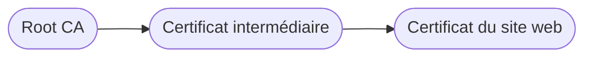
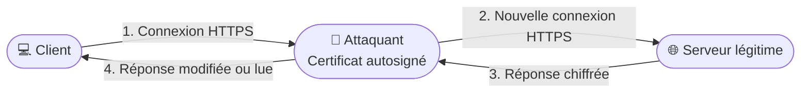
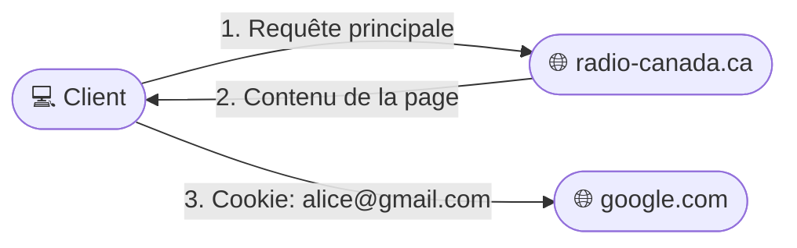
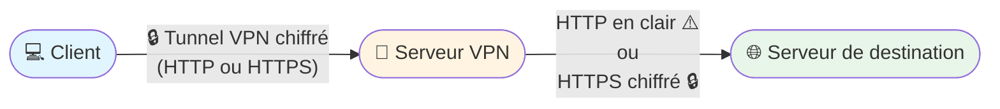

## Résumé des questions abordées

Dans cette séance, nous allons répondre aux questions suivantes :
- Que voient les fournisseurs d’accès internet (Bell, Vidéotron, Fizz…) ?
- Si HTTPS chiffre tout, comment l’internet livre mes requêtes ?
- Puis-je être certain de l'identité d'un site web en HTTPS (ex : desjardins.com) ?
- C'est grave si un certificat est autosigné ou invalide ?
- Cookie de traçage ?
- Des cookies de traçage créés par des pirates, ça existe ?
- Navigation privée, mode incognito, ça sert à quoi ?
- Un VPN ça protège contre les virus ?
- Un VPN ça permet d'aller plus vite sur internet ?
- Un VPN ça chiffre vraiment très fort ?
- Un VPN ça protège contre les sites malveillants ?

## Que voit Bell, Vidéotron, Fizz quand je navigue sur le web ?

### 5 minutes tous ensemble

Selon vous, que voient les fournisseurs d’accès internet (FAI) quand vous naviguez sur le web ?

- Peuvent-ils voir le site que je visite ?
- Peuvent-ils voir l’URL complète ?
- Peuvent-ils voir les cookies (avec quel compte tu es connecté) ?
- Peuvent-ils voir le contenu de la page ?

### Chiffrement HTTPS

HTTPS est un méta-protocole qui utilise HTTP au-dessus de TLS (Transport Layer Security).
- On utilise du chiffrement asymétrique pour échanger une clé de session pour le chiffrement symétrique.
- On utilise du chiffrement symétrique pour chiffrer le trafic entre le client et le serveur.
- Sans la clé de session, le contenu des échanges est illisible.
---

## Si HTTPS encrypte tout, comment l’internet livre mes requêtes ?

**Éléments de réponse :**
- Le chiffrement HTTPS ne concerne que le contenu de la communication (données applicatives).
- Les informations réseau (adresses IP source et destination, ports) restent visibles pour permettre l’acheminement.
- Les routeurs utilisent ces informations pour transmettre les paquets, sans jamais voir le contenu chiffré.

### Rappel, protocoles et couches

- Les fournisseurs d'accès voient l'adresse **IP** du serveur auquel vous vous connectez (ex : 142.250.190.78 pour Google).
- Si le site utilise HTTPS, ils ne voient aucun en-tête HTTP ou le corps de la requête / réponse
  - l'URL complète est un en-tête HTTP CHIFFRÉ
  - les cookies incluant ceux qui servent à identifier votre compte CHIFFRÉS
  - l'en-tête Referer qui indique la page d'origine CHIFFRÉ
  - le contenu de la page CHIFFRÉ: tout ce qui est après le nom de domaine est chiffré.
- Les adresses IP et les ports sont dans l'en-tête TCP/IP, non chiffrés.
  - IP permettent aux routeurs d'acheminer les paquets et d'indiquer l'adresse de retour
  - TCP permettent au NAT de modifier les ports pour retracer les différents clients (dans un prochain cours)
- Ils savent donc à quels serveurs vous parlez, mais pas ce que vous faites sur ces serveurs (ni les pages consultées, ni les données échangées).

- une **requête** HTTPS
- dans un **segment** TCP (port = 443 pour HTTPS, 80 pour HTTP)
- dans un **paquet** IP (nom de domaine résolu en adresse IP via DNS)
- dans une **trame** Ethernet

---

## Si je parle avec un serveur web en HTTPS, je peux être sûr que c’est bien le bon ?

desjardins.com c’est bien ma banque et pas un pirate ?

### Chaîne de confiance des certificats HTTPS

**Éléments de réponse :**
- HTTPS utilise des certificats numériques pour authentifier les serveurs.
- Si le cadenas est affiché et le certificat valide, vous parlez bien au serveur officiel (ex : desjardins.com).

---

## C'est quoi le danger si mon certificat est autosigné ou invalide ?

- Le navigateur possède une liste de certificats racines (Root CA) de confiance inclus dans le système d'exploitation.
- Le certificat du site web est signé par une autorité intermédiaire, elle-même signée par la Root CA.
- Le navigateur vérifie toute la chaîne jusqu'à la racine pour s'assurer de l'authenticité du site.
- Pendant le processus d'émission du certificat, l'autorité de certification vérifie que le demandeur contrôle bien le domaine (ex : desjardins.com)
  - souvent on demande de créer une entrée DNS ou un fichier sur le site web
  - cela peut aller jusqu'à vérifier l'identité de la personne ou de l'entreprise
  - on peut même avoir une visite physique dans les cas de certificats EV (Extended Validation)

### Man in the middle : une famille d'attaques

Dans ce scénario, l'attaquant intercepte la connexion:
- Le client croit parler au serveur, mais il parle à l'attaquant qui présente un certificat autosigné (pas le cadenas vert).
- L'attaquant ouvre une seconde connexion HTTPS vers le vrai serveur.
- Il peut lire, modifier ou enregistrer les données avant de les renvoyer.
  - parce qu'il est le client d'une connexion HTTPS
  - et le serveur de l'autre connexion HTTPS
- Le navigateur affiche un avertissement de sécurité (certificat non valide).

---

## C’est quoi un cookie de traçage ?

### Ce qu'on croit avant de faire l'exercice (5 minutes)

On va inscrire vos réponses au tableau pour comparer après l'exercice.

- Choisissez un site d'information que vous aimez bien
- Quand vous visitez la page d'accueil, combien de requêtes HTTP selon vous:
  - juste une
  - entre 2 et 10
  - entre 10 et 50
  - entre 50 et 100
  - plus de 100
- Est-ce que toutes les requêtes vont au serveur du site que vous visitez ? Oui / Non

### Activité 5 minutes individuelle
Vous allez maintenant explorer un peu les requêtes / cookies:
- ouvrez les outils de dev dans un navigateur Chrome (dans n'importe quelle page, clic droit > inspecter)
- dans les outils de dev, vous trouverez plusieurs onglets (Elements, console, sources etc.)
- on va s'intéresser à **Network** et **Application**
- ouvrez d'abord le site d'information que vous avez choisi
- choisissez l'onglet **Network** dans les outils
- rechargez la page, vous devriez voir
    1. une ligne du temps qui représente les différentes requêtes réseau
    2. une liste en dessous avec chaque requête
- dans le champ **filter** on va taper d'abord
    - **google.com** pour voir si des requêtes sont parties chez Google
    - **facebook** pour voir si des requêtes sont allées chez Facebook
- explorez les requêtes trouvées
    - en regardant l'onglet Headers du détail,
    - trouvez l'URL demandée (Request URL) pour vérifier que la requête part bien chez Google ou Facebook
- Copiez l'url du site que vous avez demandé (par exemple lapresse.ca) et l'url envoyée à Google dans votre fichier de notes (MD)

### Retour en groupe (5 minutes)

Nous allons discuter ensemble sur les questions suivantes:
1. Pourquoi le site que j'explore envoie autant de requêtes à autant d'autres sites
2. Par exemple, pourquoi un site envoie des requêtes à Google ou Facebook

**Éléments de réponse :**
- Un cookie de traçage est un petit fichier stocké par le navigateur, 
- Il est envoyé avec chaque requête envoyée au domaine associé (*.google.com par exemple)
- Si un site (lapresse.ca) provoque une requête sur sa page à *.google.com alors Google sait que vous avez visité la page.
- Google et Facebook (régies publicitaires) ont presque tout votre historique Internet.

---

## Est-ce qu’il y a des cookies de traçage faits par des méchants pirates ?

**Éléments de réponse :**
- Pour qu'une requête parte vers mechanthacker.org avec le cookie de traçage, il faut que le site visité soit complice: inclut une requête vers mechanthacker.org
- On parlerait plus de complot mondial que d'un pirate isolé dans ce cas
---

## Navigation privée, mode incognito, ça sert à quoi ?

Un mode privé ou secret dans un navigateur va habituellement:
- ne pas stocker les pages visitées dans l'historique
- ne pas envoyer les cookies précédemment existant (mais il va accumuler les cookies de la session privée)
- parfois certains navigateurs vont restreindre l'envoi des cookies de traçage
- ça change
  - ce qui reste sur ton ordinateur
  - ça bloque certains envois de requêtes ou de cookies dans des requêtes
  - ça ne change rien sur ce que le FAI voit / ne voit pas
- En exercice, démarre une session en navigation privée dans Chrome. Lis la description fournie et vois si tu comprends tout ce qui est écrit après le cours d'aujourd'hui.

---

## Un VPN protège des virus ?

**Éléments de réponse :**
- Un VPN ne voit pas le contenu du trafic (HTTPS).
  - seul le client HTTP (application ou navigateur : **Chrome**)
  - et le serveur HTTP (site web) voient le contenu
  - même le système d'exploitation ne voit pas le contenu HTTPS (Windows)
- Donc il est aveugle aux fichiers qu'on télécharge etc.
- Mais ... une "offre VPN" peut inclure un plugin au navigateur:
  - ce n'est pas vraiment le VPN qui a accès
  - c'est le plugin dans le navigateur, il a accès au contenu HTTP sans chiffrement
  - dans ce cas, le plugin peut filtrer le trafic

---

## Un VPN ça va plus vite que ma connexion internet ?

**Éléments de réponse :**
- Non, un VPN ajoute généralement de la latence et peut réduire la vitesse, car le trafic fait un détour par le serveur VPN et subit un chiffrement/déchiffrement.
- La vitesse dépend de la qualité du VPN, de la distance et de la charge du serveur.
- Au mieux ça va aussi vite que la connexion.

---

## Un VPN ça chiffre tellement fort ?

**Éléments de réponse :**
- Oui, la plupart des VPN utilisent des protocoles de chiffrement robustes (ex : AES-256).
- Mais ... 
  - uniquement jusqu'au serveur VPN, 
  - après le trafic circule habituellement du serveur VPN vers le site web.
  - utile si on utilise un Internet local censuré
- Mais ... 
  - le trafic HTTPS est déjà chiffré.
  - si on ne fait pas confiance à HTTPS, on n'a pas de société.
  - ça ne sert pas à grand chose de chiffrer du chiffré

**Important :** Le VPN crée un tunnel chiffré entre votre appareil et le serveur VPN. Cependant, une fois que le trafic sort du serveur VPN vers sa destination finale :
- Si vous utilisez **HTTP** (non chiffré), le trafic circule **en clair** et peut être intercepté.
- Si vous utilisez **HTTPS**, le trafic reste chiffré de bout en bout, rendant le VPN redondant pour la confidentialité.

---

## Un VPN ça protège contre les sites malveillants ?

**Éléments de réponse :**
- C'est possible, mais pas en se basant sur les adresses URL car elles sont le plus souvent encryptées (HTTPS).
- Si un VPN filtre les sites, c'est en se basant sur les adresses IP. 
- C'est le même mécanisme que les pare-feux.
---
