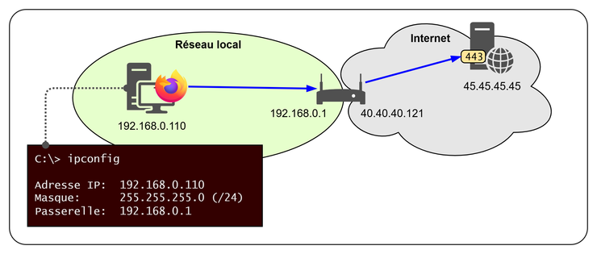
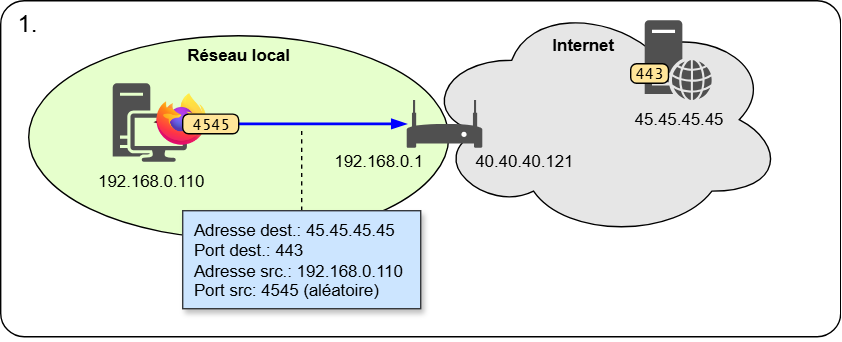
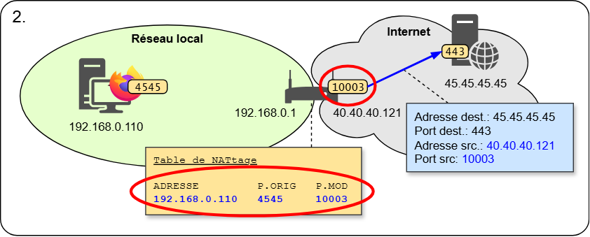
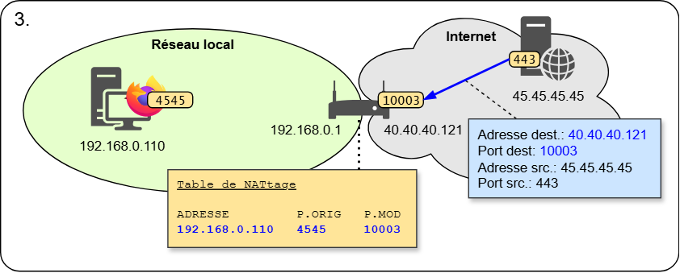
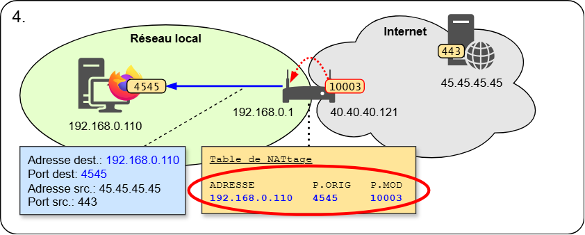

Discutons de l'adressage IP...

- Est-il **possible** que deux ordinateurs aient **la même adresse IP**?
- **Ouvrez un terminal** sur votre ordinateur et faites la commande **`ipconfig`**. Trouvez l'adresse IP de votre carte réseau connectée au réseau du CÉGEP, celle par laquelle vous sortez sur Internet. Elle devrait commencer par *10.*.
- **Comparez votre adresse** avec celle de la personne assise à côté de vous. **Que remarquez-vous?**
- Ouvrez ensuite **un navigateur** et allez sur le site **https://whatismyipaddress.com/**. Comment se fait-il que cette adresse est différente de celle donnée par `ipconfig`?
- **Comparez votre adresse IP** avec celle de la personne assise à côté de vous. **Que remarquez-vous?**


Quelques observations:

- Avec `ipconfig`, tous les ordinateurs dans le même réseau local ont une adresse différente. Par contre, il est possible qu'un autre ordinateur, ailleurs dans le monde, possède **la même adresse**.
- Avec **WhatIsMyIpAddress**, il semble que l'ordinateur ait la même adresse que toutes les autres machines de mon réseau. Mais elle semble unique (en tout cas, on ne la voit pas souvent).
- Dans les deux cas, on arrive avec une contradiction: **plusieurs ordinateurs ont la même adresse IP!** 
- Est-ce que vos profs de systèmes d'exploitation et de réseaux locaux **vous ont menti**? Qu'est-ce qui se passe??!

**Question existentielle: Si je lance une recherche sur Google, comment Google fait pour envoyer la réponse à moi et non à mon voisin?**


## Les passerelles NAT

Avec le protocole IP version 4, l'adressage IP se fait sur 32 bits. Cela donne $2^{32}$  adresses possibles, soit environ 4 milliards, ce qui semblait énorme au départ. En théorie, chaque ordinateur doit avoir une adresse IP unique pour communiquer adéquatement dans le réseau, mais avec le succès qu'Internet a connu, on a maintenant beaucoup plus que 4 milliards d'appareils connectés sur Internet et nécessitant une adresse unique. 

Le NAT (Network Address Translation) vise à résoudre ce problème. C'est une technique utilisée dans les réseaux informatiques pour modifier les adresses IP dans les en-têtes des paquets IP en cours de transit à travers un routeur ou un pare-feu. On utilise souvent cette technique lorsqu'on a plus de machines dans notre réseau interne que d'adresse IP publiques à notre disposition. 

Par exemple, à la maison, votre fournisseur d'accès Internet vous donne une seule adresse IP publique, routable sur Internet. Toutefois, vous avez plus d'une machine à la maison (ordinateurs, cellulaires, tablettes, télés connectées, etc.). Ainsi, vous pouvez avoir un grand nombre d'appareils qui partagent la même adresse IP sur Internet.

Comment est-ce possible? Comment le serveur peut savoir à qui retourner la réponse à une requête si plusieurs clients partagent la même adresse IP?

La passerelle NAT possède deux catégories d'interfaces réseau: une interface **WAN** (*wide area network*), du côté de votre fournisseur Internet, et une ou plusieurs interfaces **LAN** (*local area network*). La passerelle agit comme serveur DHCP du côté LAN pour assigner une adresse IP privée à tous les hôtes de votre réseau local (typiquement dans la plage 192.168.x.x ou 10.x.x.x). Dès que votre ordinateur tente d'envoyer un paquet IP vers Internet, le NAT intercepte ce paquet et modifie l'adresse IP de la source pour son adresse publique. Il envoie le paquet au serveur tout en gardant une copie de l'échange dans sa mémoire. Dès que la passerelle NAT reçoit la réponse du serveur, il regarde dans sa liste pour savoir quelle machine de son réseau interne a envoyé le paquet, puis modifie à nouveau l'entête du paquet et le renvoie au demandeur.

Le fonctionnement du NAT est différent de celui d'un pare-feu car il ne fonctionne pas au moyen de règles de filtrage. Il procure quand même un bon niveau de protection contre les attaques provenant d'Internet en rendant invisible de l'extérieur toutes les machines du réseau local. Si un attaquant tente de se connecter à mon ordinateur se situant derrière un NAT, c'est le NAT qui recevra la requête, et comme cette communication n'a pas été initiée par ma machine, le NAT détruira tout simplement cette requête.


### Principe de fonctionnement

On va distinguer:
- Une adresse IP **publique** sur l'internet (**unique sur tout l'internet**) 
- Une adresse IP **privée** sur un réseau local (**unique sur le réseau local**)

:::info Comment reconnaître une adresse privée?
Les adresses IPv4 privées sont des plages d'adresses IP réservées pour une utilisation au sein de réseaux privés. Elles ne sont pas routables sur l'Internet public. Voici les plages d'adresses IPv4 privées définies par le [RFC 1918](https://tools.ietf.org/html/rfc1918):

| Classe | Adresse réseau   | De:           | À :               |
| :----- | :--------------- | :------------ | :---------------- |
| A      | `10.0.0.0/8`     | `10.0.0.0`    | `10.255.255.255`  |
| B      | `172.16.0.0/12`  | `172.16.0.0`  | `172.31.255.255`  |
| C      | `192.168.0.0/24` | `192.168.0.0` | `192.168.255.255` |

Par ailleurs, il existe d'autres plages d'adresses IP qui ne sont pas routables sur Internet mais qui ne doivent pas non plus être utilisées dans des réseaux privés, sauf dans quelques cas spécifiques:
- La plage `169.254.0.0/16` (169.254.0.0 à 169.254.255.255), appelée APIPA, sert à permettre l'établissement de réseaux *ad hoc* lorsqu'il n'y a pas de serveur DHCP accessible par les clients. 
- La plage `224.0.0.0/4` (224.0.0.0 à 239.255.255.255), appelée Classe D, est réservée à des usages de multidiffusion (multicast), et la plage `240.0.0.0/4` (240.0.0.0 à 255.255.255.255), appelée Classe E, est réservée à des usages expérimentaux. Aucune de ces adresses n'est autorisée sur Internet et dans des des réseaux privés routés.
:::

---

### Exemple

import Tabs from '@theme/Tabs';
import TabItem from '@theme/TabItem';

<Tabs>

<TabItem value="scenario" label="Scénario">



À partir de votre ordinateur à la maison, vous ouvrez un navigateur pour consulter votre site Web préféré:

- L'adresse IP privée de votre ordinateur (la **source**) est `192.168.0.110`, son masque est `255.255.255.0` et sa passerelle par défaut est `192.168.0.1`.
- Le "routeur" (**NAT**) à la maison possède deux adresses IP: 
  - Son adresse interne (**LAN**) est `192.168.0.1`. Elle concorde avec l'adresse de la passerelle par défaut de l'ordinateur. 
  - Son adresse externe (**WAN**) est `40.40.40.121`. Elle lui a été attribuée par le fournisseur d'accès Internet (FAI).
- Le serveur Web qui héberge le site Web (la **destination**) possède l'adresse IP `45.45.45.45` et répond au protocole HTTPS, sur le port `443/tcp`.

Voici, étape par étape, ce qui se passe. Bien sûr, ce processus est simplifié pour faciliter la compréhension. 

</TabItem>


<TabItem value="etape1" label="Étape 1">



Votre ordinateur crée une requête Web vers le serveur. Il ouvre un port temporaire au hasard pour lui permettre de recevoir la réponse. Il crée un paquet à envoyer au serveur.
- Source: `192.168.0.110` port `4545`
- Destination: `45.45.45.45` port `443`

Puisque l'adresse de destination est dans un réseau différent, le paquet est acheminé à la passerelle par défaut.

</TabItem>

<TabItem value="etape2" label="Étape 2">



La passerelle par défaut (le *routeur*) ne peut pas acheminer tel quel le paquet, puisque l'adresse de source fait partie des plages d'adresses privées, interdites sur Internet. Autrement dit, il est impossible que le serveur Web lui réponde. Il doit effectuer une **traduction NAT**.

- L'adresse de source privée (`192.168.0.110`) va être remplacée par la sienne, qui est publique (`40.40.40.121`).
- Le port de source va être remplacé par un port au hasard disponible dans la table de NAT (par exemple, `10003`)
- Il crée une entrée dans sa table NAT, pour se rappeler à quel ordinateur, dans le réseau privé, acheminer la réponse du serveur.
  - L'adresse IP locale (`192.168.0.110`)
  - Le port de retour original (`4545`)
  - Le port de retour modifié (`10003`)

Puis il envoie le paquet modifié au routeur du fournisseur d'accès Internet. Les routeurs IP de l'Internet acheminent les paquets à la machine du serveur.

</TabItem>

<TabItem value="etape3" label="Étape 3">



Le serveur reçoit la requête et produit une réponse. Il la met dans un paquet IP à retourner au client:
- Source = `45.45.45.45` port `443`
- Destination = `40.40.40.121` port `10003` (l'adresse et le port de la partie publique du routeur)

Les routeurs IP de l'internet acheminent les paquets au routeur de la maison, à l'adresse `40.40.40.121`.

</TabItem>

<TabItem value="etape4" label="Étape 4">



Le routeur de la maison reçoit le paquet en provenance de `45.45.45.45` sur son port `10003`. Il consulte sa table de NATtage pour savoir quelle machine interne a initié cette communication. 

Puisqu'il y a une entrée correspondant au port `10003`, il construit un nouveau paquet avec comme destination l'adresse interne inscrite dans cette entrée de la table, `192.168.0.110` et le port `4545`.

Si aucune entrée correspondant au port `10003` n'avait été trouvé dans la table, le routeur n'aurait pas été capable d'acheminer cette communication dans le réseau interne. Il aurait donc ignoré le paquet, causant sa destruction immédiate.

</TabItem>

</Tabs>

---

Quelques observations:
- il y a une modification d'adresse IP et port à l'aller et au retour
- on part de l'hypothèse que le protocole respecte les conventions IP et TCP sur les adresses et ports
- s'il n'y a pas de paquet qui est sorti du réseau local, un paquet ne peut pas arriver au routeur et être envoyé à une machine avec adresse privée


### Exercice 1

Dans la situation suivante:
- mon adresse IP privée est **192.168.0.111**
- j'envoie une requête HTTPS au serveur cegepmontpetit.ca (adresse IP est **35.203.2.187**)
- le port source a été fixé à **6054**
- mon routeur à la maison applique un NAT dynamique son adresse IP publique est **77.88.99.11**
- après le passage de la requête la table NAT contient une entrée
  - IP **192.168.0.111**
  - port source original **6054**
  - port source traduit **6754**

📝 Remplissez les en-têtes IP et TCP demandées pour la requête reçue par le serveur:
```
IP destination:............. ___.___.___.___
IP source:.................. ___.___.___.___
TCP port destination:....... _____
TCP port source:............ _____
HTTPS:...................... Chiffré
```

### Exercice 2

La requête locale:

```
IP destination:............. 66.147.239.61
IP source:.................. 192.168.1.45
TCP port destination:....... 443
TCP port source:............ 9876
HTTPS:...................... Chiffré
```

a été traduite par NAT dans la requête:

```
IP destination:............. 66.147.239.61
IP source:.................. 192.222.150.48
TCP port destination:....... 443
TCP port source:............ 5675
HTTPS:...................... Chiffré
```

📝 Quelle entrée a été ajoutée dans la table NAT?
```markdown

```

📝 Quelle est l'adresse IP **publique** du routeur NAT?
```markdown

```


### Questions / discussions

1. Selon vous, si 2 ordinateurs de ma maison sur le Wifi envoient tous les deux des requêtes au même serveur
comment le routeur peut savoir à quel ordi, il doit envoyer une réponse quand elle arrive de l'Internet?

2. Si à chaque fois que j'envoie une requête vers l'Internet, il se crée une entrée dans une table de NAT,
depuis le temps comment la mémoire vive de mon routeur n'a pas explosé?

3. Quand je suis à la maison, c'est quoi mon adresse IP?


### Sens de l'initiation

Derrière un NAT, dans le réseau local, les appareils possèdent une adresse IP privée, non routable. Les appareils dans le réseau local ne sont pas conscients de leur adresse IP publique puisque c'est le NAT qui s'occupe de faire la traduction pour eux. Conséquemment, les appareils sur Internet ne connaissent pas ceux du réseau local; la seule manière qu'ils ont de communiquer avec eux est via la passerelle NAT, qui se rappelle de qui a initié la demande.

Autrement dit, les appareils derrière un NAT ne peuvent recevoir du trafic que lorsqu'ils ont eux-mêmes initié une connexion. Le seul appareil du réseau local qui puisse être accédé directement sans avoir initié la communication est la passerelle NAT elle-même. Si elle reçoit un paquet qui n'a pas été initié par un appareil du réseau privé, ce paquet sera détruit.

**Le NAT constitue donc une protection très efficace contre les cyberattaques provenant d'Internet, pour autant que la passerelle soit exempte de vulnérabilités.**


### Redirection de port

Pour permettre à du trafic initié à l'extérieur du réseau local d'être acheminé à une machine du réseau privé, on peut configurer la passerelle NAT pour ouvrir un port d'écoute et le rediriger vers une machine du réseau interne, en effectuant la traduction dans l'autre sens. Ce procédé s'appelle la **redirection de port**.

Par exemple, un serveur Web situé dans le réseau local (par exemple, 192.168.0.105) écoute sur le port 443 (https). Un client sur Internet accède au serveur avec l'adresse du NAT (40.40.40.121) sur son port 443. Elle redirige les requêtes entrantes sur ce port au serveur du réseau interne et réachemine les réponses aux clients en ayant fait la demande. Dans la perspective du client, le serveur Web est la passerelle NAT.

Pour que la redirection de port fonctionne, il faut préalablement configurer le NAT en spécifiant un port d'écoute, ainsi que l'adresse privée et le port du serveur. Fait intéressant, le port externe et le port interne ne sont pas forcément les mêmes. On pourrait avoir le NAT qui écoute sur le port 443 mais qui redirige ses requêtes sur le port 1234 sur le serveur interne.


