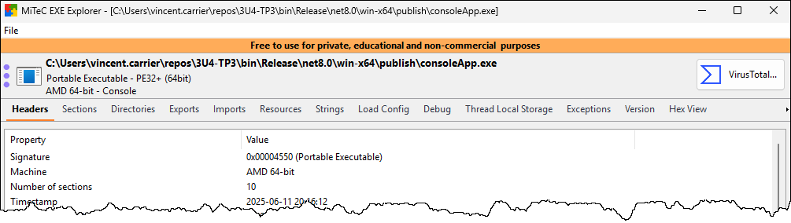

## Retour sur l'examen

Nous passerons à travers l'examen 2 pour donner un correctif à l'oral. 

Vous pourrez ensuite demander à revoir votre copie pendant la partie pratique.


## Sécurité applicative

Une application est un programme (ou un ensemble de programmes) qui traduit des instructions fornies par l'utilisateur en actions effectuées par le système. Toute application peut contenir des failles de sécurité qui pourraient être exploitées par un utilisateur malveillant. De telles failles peuvent se trouver à plusieurs endroits:
- Dans le **code source** du programme
- Dans sa manière de **stocker** l'information (par exemple, dans une base de données)
- Dans sa manière de **communiquer** l'information à un autre système

Pour trouver des failles à exploiter, un utilisateur malveillant a plusieurs techniques à sa disposition. Nous allons en explorer quelques unes.


## L'ingénierie inverse

Supposons que le hacker est en contact avec un fichier exécutable. Habituellement, un programme exécutable est compilé en code machine et donc très difficile à lire par un humain, mais ce n'est pas toujours le cas. On peut retrouver trois grandes catégories de fichiers exécutables:

- **Code machine (natif)**: Les langages comme C, C++, Delphi, Rust et Go sont dotés de compilateurs dits "natifs" ou "ahead-of-time", qui produisent du code machine directement exécutable par le processeur. Le code compilé est spécifique à une architecture précise de processeur (comme x86-64 ou arm64) ainsi qu'à un système d'exploitation (Windows, Linux...) et donc n'est pas portable.
- **Code intermédiaire (bytecode)**: Les langages comme C#, VB.NET ou Java ne sont pas compilés en code machine. À la place, ils sont compilé en langage intermédiaire (C# et VB.NET sont compilés en MSIL pour CLR, Java est compilé en bytecode Java pour la JVM). Pour permettre une portabilité, ce code est traité à l'exécution par un procédé nommé "compilation Just-In-Time (JIT)", et c'est le framework logiciel qui se charge de traduire ce code en instructions pour le processeur.
- **Code interprété (script)**: Finalement, des langages comme JavaScript, PowerShell et bash ne sont pas compilés. Le fichier exécutable est en fait un fichier texte qui, lorsque passé dans un interpréteur, est traduit en instructions pour le système.

L'ingénierie inverse, ou rétro-ingénierie, c'est l'art de partir du programme exécutable et d'en comprendre le fonctionnement, c'est-à-dire en lisant le code source. Dépendant du type d'exécutable, ce procédé peut être assez difficile.

Les programmes compilés natifs sont les plus difficiles à en déduire le code source, car celui-ci est perdu. En décompilant (ou en désassemblant) du code natif au moyen d'outils spécialisés comme [IDA Pro](https://hex-rays.com/ida-pro), [Ghidra](https://github.com/NationalSecurityAgency/ghidra) et [Cutter](https://cutter.re/), on obtient des instructions de bas niveau, qu'on peut traduire en langage d'assemblage (appelé Assembleur ou ASM), qui est très difficile à comprendre ([Voici un exemple de "Hello World" programmé en assembleur](https://github.com/nukethebees/github_io/tree/main/hello_world_win_asm)). Certains outils peuvent essayer de convertir ce code dans un langage de plus haut niveau comme le C, mais ce n'est généralement pas très efficace.

Les programmes compilés en code intermédiaires, bien qu'ils soient souvent des .exe, contiennent du code source dans un langage qui, bien que différent, peut généralement être restauré à l'aide d'un logiciel de décompilation. Les applications .NET (programmées en C# ou en Java) peuvent être décompilées en utilisant des logiciels comme [JetBrains dotPeek](https://www.jetbrains.com/decompiler/) ou [ILSpy (opensource)](https://github.com/icsharpcode/ILSpy). Des produits semblables existent pour Java, comme [Java Decompiler](https://java-decompiler.github.io/).

Les programmes interprétés, quant à eux, ne sont pas compilés donc on peut consulter leur code source directement au moyen d'un éditeur de texte.


## Exercice de décompilation

Commencez par télécharger l'application [MonSecret.exe](https://github.com/departement-info-cem/3U4-cybersec/raw/refs/heads/main/stock/exerciceDecompilation/MonSecret.exe) et tentez de l'exécuter sur votre ordinateur. Le défi est d'analyser le programme pour trouver le code secret.


### Analyser avec un éditeur de texte

Premièrement, vous pouvez essayer d'ouvrir le fichier exe dans un éditeur de texte (comme le bloc-notes) pour en reconnaître les chaînes de caractères. À travers tout ce charabia, pouvez-vous reconnaître du texte lisible? Chercher le code là-dedans est un peu comme chercher une aiguille dans une botte de foin, mais vous pouvez au moins obtenir des indices que ce code est compilé en .NET pour CLR. En trouvez-vous?


### Ressortir les chaînes de caractères

L'outil [Strings](https://learn.microsoft.com/fr-ca/sysinternals/downloads/strings) permet de sortir toutes les chaînes de caractères lisibles (ASCII et Unicode). Téléchargez l'outil et sauvegardez-le dans un répertoire sur votre ordinateur (vous aurez besoin de l'extraire du fichier Zip). 

Pour lancer l'outil, vous ne pouvez pas simplement double-cliquer dessus puisqu'il s'agit d'un outil en ligne de commande. Démarrez un terminal (cmd ou PowerShell) et déplacez-vous dans le répertoire où se trouve l'outil. Puis lancez l'outil avec la syntaxe suivante:

```
.\strings.exe -n 8 "chemin\vers\monSecret.exe" > .\strings.txt
```

L'argument `-n 8` indique qu'on veut extraire les chaînes de 8 caractères et plus. Le chemin doit pointer vers le fichier exécutable à analyser. Finalement, `> .\strings.txt` permet de dévier la sortie vers un fichier texte plutôt que dans la console.

Ouvrez ensuite le fichier texte dans un éditeur de votre choix et tentez de trouver le code secret. N'ayez crainte, si vous ne le trouvez pas, nous avons d'autres outils à notre disposition.

:::tip
Voici un autre outil intéressant: [MiTeC EXE Explorer](https://www.mitec.cz/wp/mee/). Il permet d'obtenir une foule d'informations techniques sur un fichier exécutable. Un de ses onglets permet de lister les chaînes de caractères affichables, comme Strings mais en interface graphique. Par contre, on ne peut pas spécifier un nombre de caractères. On peut aussi explorer les ressources incluses dans le fichier. Bref, c'est intéressant à essayer. Notez que cet outil n'est gratuit que pour un usage personnel, éducatif et non commercial.


:::


### Décompiler l'application

Sans nécessairement trouver toute l'information à l'aide des outils précédents, nous avons pu déterminer qu'il s'agit d'une application .NET. Il y a donc du code intermédiaire. Nous pouvons tenter de décompiler le programme afin de lire le code source en C#. 

On va utiliser **dotPeek** de JetBrains pour décompiler l'application:
- Au cégep, démarrez le logiciel JetBrains Toolbox à partir du menu Démarrer et installez DotPeek
- À la maison, [suivez ce lien](https://www.jetbrains.com/decompiler/download/?section=offline-installer) pour télécharger et installer DotPeek.
  
Essayez de décompiler l'application fournie. Il sera plus facile maintenant de non seulement voir le code secret, mais comprendre le fonctionnement de l'application.

:::tip
Il existe d'autres logiciels de décompilation DotNet. Le préféré de Vincent est [ILSpy](https://github.com/icsharpcode/ILSpy). Son mode de fonctionnement est sensiblement le même.
:::


## TP3

Nous allons explorer l'application fournie pour le cours:
- l'application se trouve dans le repo du cours: https://github.com/departement-info-cem/3U4-TP3
- trouvez la section « Releases » 
- vous devriez trouver un fichier **consoleApp.exe**

Dans les 4 prochaines semaines, nous allons voir comment on peut attaquer un système puis le défendre sur 3 aspects:
- le cassage d'un mot de passe sur une BD fuitée
- le cassage d'une encryption sur une BD fuitée
- l'injection SQL sur l'application (sans BD fuitée)

### Exercice / activité: se familiariser avec l'application

1. Téléchargez l'application compilée: https://github.com/departement-info-cem/3U4-TP3/releases/latest
2. Lancez l'application et utilisez-la.
  - créer un compte
  - se connecter / déconnecter
  - quitter puis la redémarrer
  - essentiellement tester toutes les possibilités de l'application
3. N'hésitez pas à poser des questions sur l'utilisation de l'application.


### Exercice: bouger l'application

1. Lancer l'application
2. Créer un compte et s'y connecter
3. Fermer l'application
4. Déplacer le .exe dans un dossier différent
5. Relancer l'application
6. Essayer de se connecter
7. Qu'est-ce qui se passe?


## Partir votre TP

Pour ce TP, vous allez devoir:
- effectuer des attaques sur l'application
- modifier le code pour sécuriser l'application

Pour cela, aujourd'hui vous allez devoir:
1. Créer votre repo en utilisant le lien envoyé par votre prof
2. Créer votre fichier rapport.md où vous documenterez les attaques
3. Copier le projet de l'application dans votre repo. C'est là que vous mettrez les correctifs.
4. Vous trouverez le projet de l'application [ici](https://github.com/departement-info-cem/3U4-TP3)


