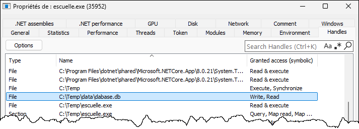
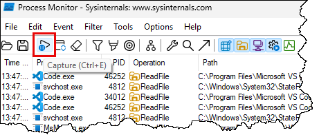
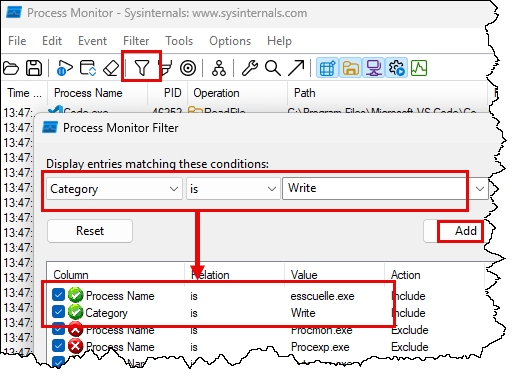
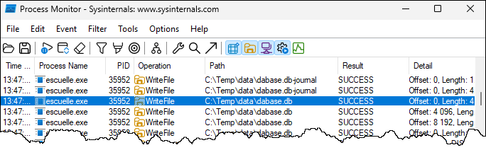

# Hachage (attaque)

Dans notre application, la BD peut éventuellement fuiter:
- on a mal protégé un serveur qui héberge la BD
- un employé fâché a copié la BD sur une clé USB et l'a emportée
- on a revendu un serveur de sauvegarde sans effacer les données et il y a une sauvegarde de la BD d'il y a un mois
- etc.

Pour le cas du TP3, la BD est directement dans un fichier quelque part sur l'ordinateur.

## Activité : Mais où est la BD?

Après avoir lancé l'application:
1. partez l'application
2. créez quelques utilisateurs etc.
3. dans les fichiers du projet, essayez de trouver dans quel fichier se trouve la BD. 

:::tip Quelques stratégies pour localiser un fichier

L'application du TP maintient une base de données localement sur l'ordinateur. Bien sûr, vous ne savez pas où cette base de données se trouve sur le disque dur. Il existe diverses techniques pour connaître l'emplacement d'un fichier maintenu par une application. C'est un autre aspect de l'ingénierie inverse: plutôt que de comprendre l'application par son code, on va plutôt comprendre l'application en observant les détails de son fonctionnement.

**System Informer**

[System Informer](https://sourceforge.net/projects/systeminformer/) est une sorte de gestionnaire de tâches mais beaucoup plus puissant. Il permet d'accéder à de l'information système sur un programme en cours d'exécution, comme le contenu de sa mémoire et tous les objets système dont il dépend. Par exemple, vous pouvez obtenir la liste de tous les fichiers ouverts par l'application (dans les propriétés du processus, onglet *Handles*).

**Process Monitor**

Au lieu d'analyser le code d'un programme, [Process Monitor de Sysinternals](https://learn.microsoft.com/en-us/sysinternals/downloads/procmon) surveille l'activité d'un processus sur le système d'exploitation: tous les accès au registre, au système de fichiers, au réseau... Si l'application lit ou écrit un fichier et que vous vous demandez son emplacement (par exemple, un fichier de configuration, une BD locale, un fichier log...), démarrez Procmon, lancez l'application puis terminez la trace. C'est un outil assez complexe à maîtriser mais très puissant.

Voici un exemple d'utilisation pour localiser l'emplacement d'un fichier BD accédé par l'application:
- Téléchargez l'outil [Process Monitor](https://learn.microsoft.com/en-us/sysinternals/downloads/procmon) et extrayez le fichier Zip.
- Démarrez l'outil en double-cliquant dessus. Il commence déjà à capturer dès son démarrage (attention de ne pas le laisser rouler trop longtemps, car il ramasse énormément d'informations).
- Rapidement, lancez l'application ou effectuez l'action qui effectue une modification (par exemple, créer un compte ou écrire une valeur)
- Une fois l'action terminée, arrêtez la capture en cliquant sur le bouton "Capture"

    

- Ensuite, entrez quelques filtres. Par exemple, on recherche une opération d'écriture venant d'un exécutable spécifique.

    

- Cliquez OK pour enregistrer les filtres. Vous verrez chaque tentative d'écriture de fichier et vous pourrez ainsi localiser l'emplacement de la BD.

    

:::

## Activité : Ouvrir une BD

Une fois qu'on a trouvé le fichier d'une BD, on veut trouver une application qui permet de l'ouvrir.

**DataGrip** est une application qui va pouvoir ouvrir une BD même si vous ne connaissez pas son format.

1. Téléchargez DataGrip soit par JetBrains Toolbox ou directement sur le site de JetBrains
2. Ouvrir / Lancer DataGrip
3. Ouvrir le fichier de la BD que vous avez trouvé

Vous devriez maintenant savoir quel moteur de base de données est utilisé et voir les tables.

Vous pouvez prendre en notes vos manipulations pour les inclure dans votre rapport du TP3.

## Activité: sortir les hachages

Vous allez trouver dans le dossier stock du repo un fichier appelé **leaked.db**.

En utilisant une application pour ouvrir la BD, vous pouvez l'ouvrir et la parcourir.

En regardant la bonne table vous allez trouver les hachages des mots de passe.

Essayez de craquer ces mots de passe et prenez en note les mots de passe que vous avez réussi à récupérer.

## Avancer mon TP3

Vous devriez maintenant avoir une piste pour attaquer les mots de passe des premiers ministres.

