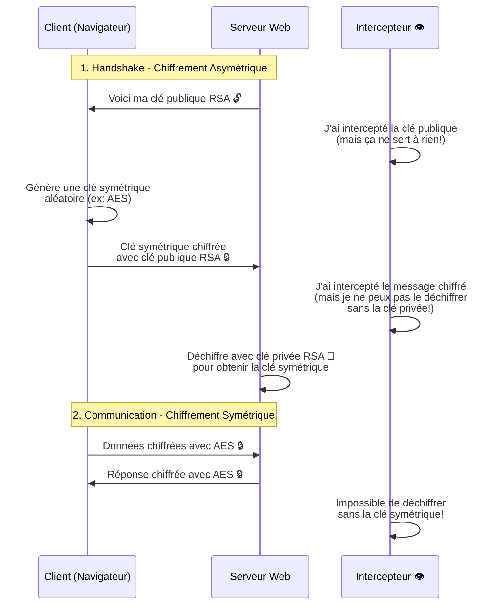

# Chiffrement asymétrique

## Différence avec le chiffrement symétrique

Dans le chiffrement symétrique, la même clé est utilisée pour chiffrer et déchiffrer. Le problème majeur est: comment partager cette clé de manière sécurisée?

Le chiffrement asymétrique résout ce problème en utilisant **deux clés différentes**:
- Une **clé publique** pour chiffrer (peut être partagée avec tout le monde)
- Une **clé privée** pour déchiffrer (doit rester secrète)

## Principe de fonctionnement

Utiliser un algo asymétrique avec une clé publique de chiffrement et une privée pour le déchiffrement:
- l'application peut chiffrer les mots de passe avec la clé publique >> voir JeanLouisEtFils dans le dossier **asym**
- le déchiffrement nécessite une clé privée >> voir corpoDecryptor dans le dossier **asym**
- la clé privée est plus complexe et en général reliée par un problème de calcul très difficile 
- on utilise ici l'algorithme RSA

## Lien mathématique entre clés

Exemple de lien entre clé privée et publique:
- on tire 2 nombres premiers très grands x et y
- la clé publique est **""+x*y**
- la clé privée est **x +":"+y**
- il est très difficile de trouver x et y à partir de x*y mais très facile de vérifier que x*y est bien égal à la clé publique

C'est ce qu'on appelle un **problème à sens unique**: facile à calculer dans un sens, très difficile dans l'autre.

## Le cas classique du client-serveur

1. L'application cliente envoie les données au serveur, la sécurité des données repose sur HTTPS (crypto asymétrique).
2. Le serveur chiffre (symétrique) les données avant de les stocker en BD, la sécurité repose sur le secret de la clé.

## Avantages et inconvénients

### Avantages
- Pas besoin de partager la clé secrète
- Permet la signature numérique
- Utilisé pour HTTPS, SSH, etc.

### Inconvénients
- Beaucoup plus lent que le chiffrement symétrique
- Clés plus longues nécessaires pour la même sécurité
- Plus complexe à implémenter

---

## Application pratique : Le handshake HTTPS

Dans la vraie vie, on utilise **les deux types de chiffrement ensemble** pour combiner leurs avantages !

### Comment ça fonctionne



### Pourquoi cette approche hybride ?

1. **Asymétrique pour l'échange de clé** : Sécurisé, pas besoin de partager un secret à l'avance
2. **Symétrique pour les données** : Rapide, efficace pour de gros volumes de données

### Sécurité

Même si un attaquant intercepte tout le trafic :
- Il obtient la clé publique (normal, elle est publique !)
- Il voit la clé symétrique chiffrée (mais ne peut pas la déchiffrer sans la clé privée)
- Il voit les données chiffrées (mais ne peut pas les déchiffrer sans la clé symétrique)

**Résultat** : Toute la communication reste sécurisée ! 🔐


---

# Exercices et CTF

## Exercice: Comprendre RSA et la génération de clés

### Pourquoi on ne peut pas juste inventer des clés RSA?

Contrairement au chiffrement symétrique où une clé peut être n'importe quelle chaîne de caractères (même si ce n'est pas recommandé), les clés RSA ont une structure mathématique précise:

1. Les clés RSA sont basées sur deux nombres premiers très grands (p et q)
2. La clé publique contient le module n = p × q et un exposant e
3. La clé privée contient les facteurs premiers p et q (ou d'autres paramètres calculés à partir d'eux)
4. Il existe une relation mathématique stricte entre clé publique et privée

**Ce qui NE marche PAS**:
```csharp
// ❌ FAUX - On ne peut pas juste mettre du Base64 aléatoire
string clePublique = "SGVsbG9Xb3JsZA==";  // Juste du texte encodé
string clePrivee = "TW9uU2VjcmV0";        // Ça ne veut rien dire en RSA!
```

**Ce qui marche**:
```csharp
// ✅ CORRECT - Utiliser RSA pour générer les clés
using (var rsa = RSA.Create(2048))  // 2048 bits de sécurité
{
    string clePublique = rsa.ToXmlString(false);  // Clé publique en XML
    string clePrivee = rsa.ToXmlString(true);     // Clé privée en XML
}
```

### Démonstration du lien mathématique

Les clés sont liées par des propriétés mathématiques:
- Ce qui est chiffré avec la clé publique ne peut être déchiffré qu'avec la clé privée correspondante
- Les clés générées aléatoirement ne fonctionneront pas ensemble
- Si vous essayez d'utiliser une "fausse" clé, vous obtiendrez des erreurs ou du charabia

---

## 🚩 CTF-implemente-rsa (5 points)

📄 **Fichier de remise**: Un repo GitHub avec votre code + `ctf-implemente-rsa.md`

**Objectif**: Créer une application console .NET complète qui démontre le chiffrement/déchiffrement RSA de bout en bout, en vous inspirant de JeanLouisEtFils et corpoDecryptor asymétriques.

### Préparation: Explorer les applications existantes

Avant de commencer, explorez les applications du dossier **asym** :
- **JeanLouisEtFilsAsym** : L'application qui chiffre avec la clé publique
- **corpoDecryptor (version asym)** : L'application qui déchiffre avec la clé privée

**À faire** :
1. Décompilez les deux applications avec dotPeek ou ILSpy
2. Identifiez comment les clés sont générées et utilisées
3. Repérez les méthodes de chiffrement et déchiffrement
4. Observez le format des clés (XML) et comment elles sont manipulées

:::warning Attention
Ne copiez pas le code tel quel ! Utilisez-le comme **référence** pour comprendre comment RSA fonctionne en .NET, puis implémentez votre propre solution.
:::

### Votre mission

Créez une application console en C# qui contient:

#### 1. Une classe `RsaCrypto` avec les méthodes suivantes:

```csharp
public class RsaCrypto
{
    // Génère une paire de clés RSA (publique + privée)
    public (string publicKey, string privateKey) GenerateKeys(int keySize = 2048);
    
    // Chiffre un texte avec la clé publique
    public string Encrypt(string plainText, string publicKey);
    
    // Déchiffre un texte avec la clé privée
    public string Decrypt(string encryptedText, string privateKey);
}
```

#### 2. Un `Main()` qui démontre:

```csharp
static void Main(string[] args)
{
    var crypto = new RsaCrypto();
    
    // 1. Génération des clés
    var (publicKey, privateKey) = crypto.GenerateKeys();
    Console.WriteLine("=== Clés générées ===");
    Console.WriteLine($"Clé publique: {publicKey.Substring(0, 100)}...");
    Console.WriteLine($"Clé privée: {privateKey.Substring(0, 100)}...");
    
    // 2. Chiffrement
    string message = "Mon mot de passe secret: P@ssw0rd123!";
    string encrypted = crypto.Encrypt(message, publicKey);
    Console.WriteLine($"\nMessage original: {message}");
    Console.WriteLine($"Message chiffré: {encrypted}");
    
    // 3. Déchiffrement
    string decrypted = crypto.Decrypt(encrypted, privateKey);
    Console.WriteLine($"Message déchiffré: {decrypted}");
    
    // 4. Démonstration de l'échec avec une mauvaise clé
    DemontreMauvaiseCle(crypto, encrypted);
}
```

#### 3. Une démonstration que les "fausses clés" ne marchent pas:

```csharp
static void DemontreMauvaiseCle(RsaCrypto crypto, string encrypted)
{
    Console.WriteLine("\n=== Test avec une fausse clé ===");
    
    // Générer une autre paire de clés
    var (_, wrongPrivateKey) = crypto.GenerateKeys();
    
    try
    {
        string result = crypto.Decrypt(encrypted, wrongPrivateKey);
        Console.WriteLine("❌ Erreur: la décryption a réussi avec la mauvaise clé!");
    }
    catch (Exception ex)
    {
        Console.WriteLine("✅ Comme prévu, la décryption échoue avec la mauvaise clé");
        Console.WriteLine($"Erreur: {ex.Message}");
    }
}
```

### Ce qu'il faut remettre

1. Votre code source complet sur GitHub
2. Un fichier `ctf-implemente-rsa.md` contenant:
   - Le lien vers votre repo GitHub
   - Des screenshots de l'exécution montrant:
     - La génération des clés
     - Le chiffrement d'un message
     - Le déchiffrement réussi
     - L'échec avec une mauvaise clé
   - Explication de pourquoi on ne peut pas juste "inventer" des clés RSA
   - Ce que vous avez appris en explorant JeanLouisEtFilsAsym et corpoDecryptor

:::tip Indices pour l'exploration
- Cherchez les classes ou méthodes contenant "RSA" ou "Crypto" dans le code décompilé
- Regardez comment `ToXmlString()` et `FromXmlString()` sont utilisés
- Observez la gestion des exceptions lors du déchiffrement
- Notez comment le texte est converti en bytes puis en Base64
:::

:::tip Ressources utiles
- [Documentation RSA .NET](https://learn.microsoft.com/en-us/dotnet/api/system.security.cryptography.rsa)
- [RSA Example in C#](https://learn.microsoft.com/en-us/dotnet/standard/security/cryptographic-services)
- Les applications JeanLouisEtFilsAsym et corpoDecryptor (dossier asym) comme référence
:::

---

## 🚩 CTF-cle-publique (1 point)

📄 **Fichier de remise**: `ctf-cle-publique.md`

**Objectif**: Extraire la clé publique RSA depuis l'exécutable JeanLouisEtFilsAsym.

**Votre mission**:
1. Téléchargez l'application JeanLouisEtFilsAsym (dossier asym)
2. Utilisez un décompilateur .NET (dotPeek, ILSpy) pour analyser le code
3. Trouvez la **clé publique RSA** utilisée pour le chiffrement

:::info Format de la clé
Les clés RSA en .NET sont souvent au format XML ou PEM. Cherchez des balises comme `<RSAKeyValue>` ou des méthodes qui importent/exportent des clés.
:::

**Récompense**: 1 point au tableau des scores.

**À noter dans votre rapport**:
- La clé publique complète (format XML ou PEM)
- La taille de la clé en bits (ex: 2048, 4096)
- Le fichier source où vous l'avez trouvée

---

## 🚩 CTF-decrypt-asym (3 points)

📄 **Fichier de remise**: `ctf-decrypt-asym.md`

**Objectif**: Analyser la sécurité d'une implémentation RSA et comprendre pourquoi elle est inviolable.

**Contexte**: Vous avez récupéré un fichier `encrypted-data-rsa.txt` qui contient des données chiffrées avec la clé publique RSA. Mais pour déchiffrer, il faut la clé privée...

**Votre mission**:
1. Analysez le fichier de données chiffrées
2. Cherchez dans le code source décompilé s'il existe des failles
3. Analysez la clé publique extraite dans CTF-cle-publique

**Questions à explorer et répondre**:
- La clé privée est-elle présente quelque part dans l'application? (Vérifiez TOUS les fichiers)
- Y a-t-il un fichier de configuration qui pourrait contenir des clés?
- Quelle est la taille de la clé RSA? Est-elle assez grande pour être sécuritaire?
- Expliquez pourquoi il est mathématiquement impossible de casser cette clé publique pour retrouver la clé privée
- Combien de temps faudrait-il pour factoriser le module n de cette clé avec les ordinateurs actuels?

:::info Ce que vous devez démontrer
Le but n'est PAS de réussir à déchiffrer (c'est impossible si c'est bien fait), mais de **prouver que vous comprenez pourquoi c'est impossible** et d'analyser la sécurité de l'implémentation.
:::

**Récompense**: 3 points pour une analyse complète et correcte.

**À inclure dans votre rapport**:
- Recherche méthodique de la clé privée (où avez-vous cherché?)
- Analyse de la clé publique (taille, module n, exposant e)
- Explication mathématique de pourquoi on ne peut pas casser RSA 2048+ bits
- Estimation du temps de calcul nécessaire pour factoriser
- Conclusion: est-ce cassable ou non, et pourquoi?

---

## Temps pour le TP

Continuez à travailler sur votre TP3.
